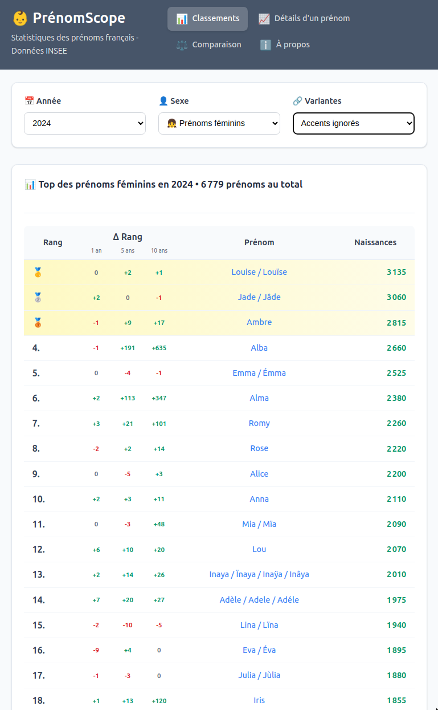
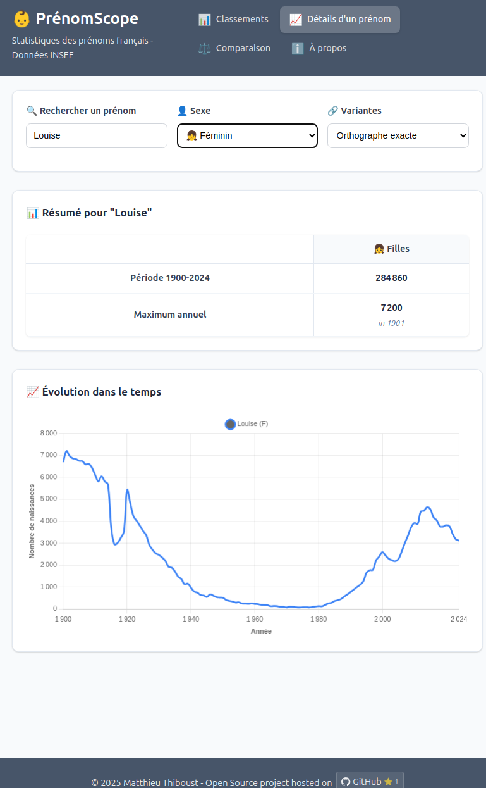
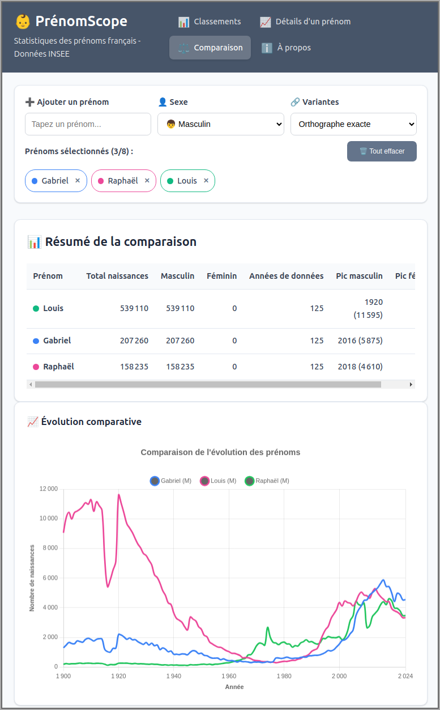

# PrénomScope

A French baby names analysis tool based on official INSEE data. Visualize name trends, rankings, and statistics from 1900 to present.

🌐 **Live Website**: [https://mthiboust.github.io/prenomscope/](https://mthiboust.github.io/prenomscope/)

  
  &nbsp;&nbsp;&nbsp;&nbsp;&nbsp;
  
  &nbsp;&nbsp;&nbsp;&nbsp;&nbsp;
  

## About

PrénomScope is a vibe-coding experiment that makes French baby names data more accessible and visual. It transforms raw INSEE (French National Institute of Statistics) data into an interactive web application for exploring name trends and statistics.

The project was created as a fun experiment to learn modern web development while building something useful with public data.

## Features

- 📊 **Name Rankings**: View top names by year and gender
- 📈 **Name Details**: Explore individual name trends and statistics
- ⚖️ **Name Comparison**: Compare multiple names side by side
- 🔗 **Name Grouping**: Group similar names together for better analysis
- 📱 **Responsive Design**: Works on desktop and mobile

## Technologies Used

- **Data**: DuckDB WASM with parquet file
- **Frontend**: SvelteKit (Svelte 5)
- **Styling**: CSS with Tailwind-inspired design system
- **Deployment**: Github Pages

## Data Source

All data comes from the French National Institute of Statistics (INSEE). The application uses the Répertoire national d'identification des personnes physiques (RNIPP) which contains birth records from 1900 to present.

For detailed methodology and definitions, visit the [official INSEE page](https://www.insee.fr/fr/statistiques/8595130?sommaire=8595113).

## License

This project is open source and available under the Apache License.